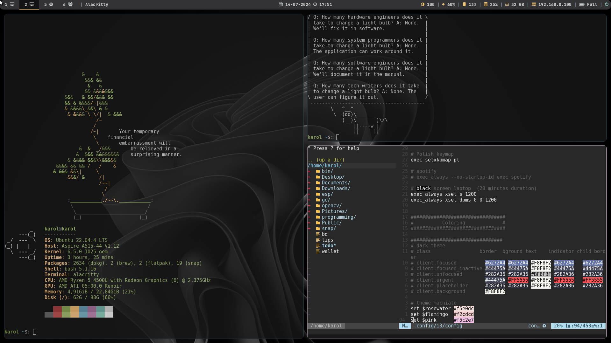

# Dotfiles for linux
Currently using on Ubuntu 22.04, with a few bash programs

| Module | Version | Description
| -      | -       | -
| [i3](https://i3wm.org/) | `4.23`| New display management
| [polybar](https://github.com/polybar/polybar) | `3.5.7`| Customizing bar
| [rofi](https://github.com/davatorium/rofi) | `1.7.1`| Search app
| [picom](https://github.com/yshui/picom) | `v9`| Customizing windows - transparent background

## Additional tools

| Name | Version | Description
| - | - | -
| [nvim](https://github.com/neovim/neovim) | `v0.6.1` | Fast and light text editor
| [zoxide](https://github.com/ajeetdsouza/zoxide) | `0.4.3` | Smart `cd` command
| [exa](https://github.com/ogham/exa) | `0.10.1` | More convinent `ls` command

